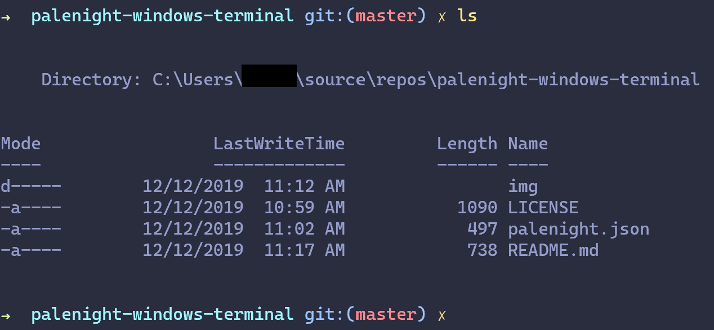
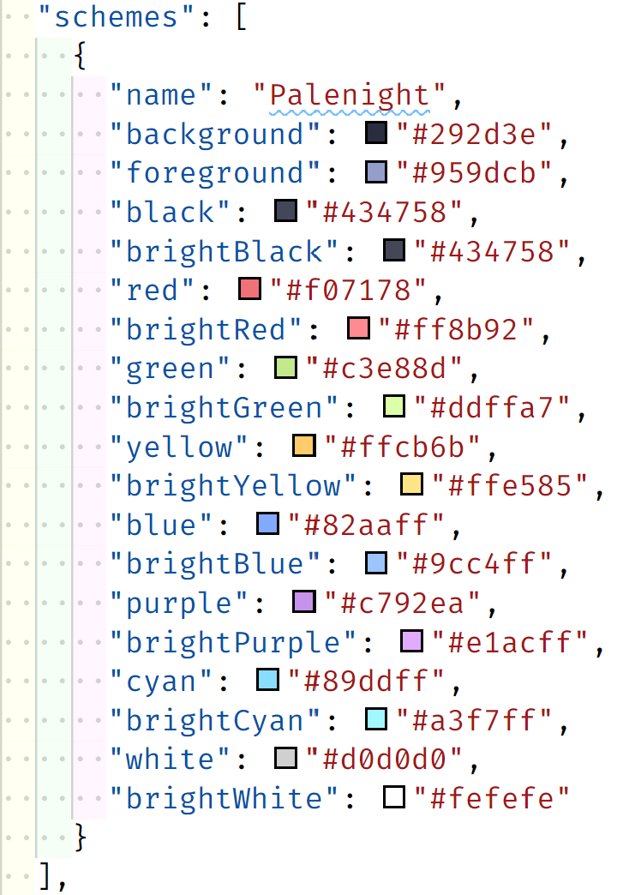

# palenight-windows-terminal

A Palenight color scheme for the new Windows terminal.



## Installation

1. Copy the JSON from `palenight.json` into the the `schemes` section of your Windows Terminal's configuration file:

    

2. Use it in one of your profiles, e.g.
    ```javascript
    {
      "guid": "{...}",
      "name": "Windows PowerShell",
      "commandline": "powershell.exe",
      "hidden": false,
      "fontFace": "Cascadia Code",
      "colorScheme": "Palenight"
    }
    ```
## License

MIT, see [LICENSE](LICENSE)
